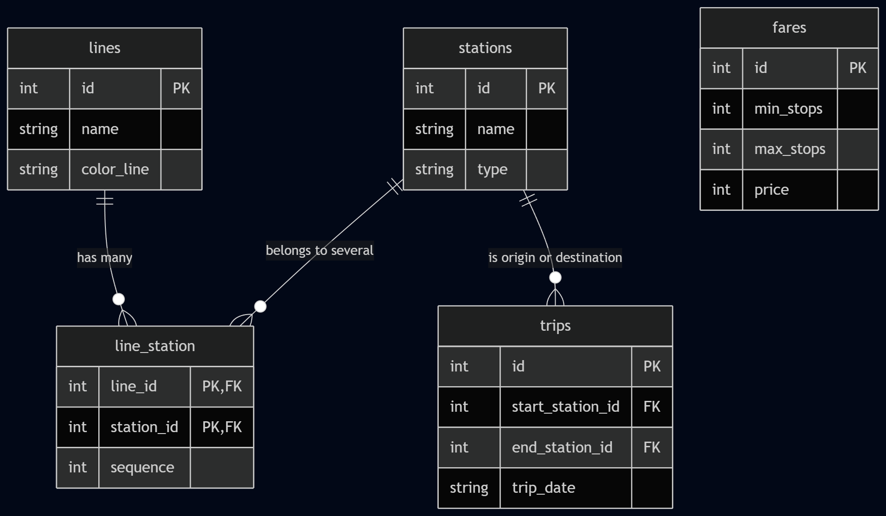

# Design Document

By Kurollos Talat Shaker Zaka

Helwan University, Faculty of Science

Department of Statistics and Computer Science

Project's Title: The Cairo Metro DataBase System

## Scope

In this section you should answer the following questions:

* What is the purpose of your database?

This database models the Greater Cairo Metro network — its lines, stations, and the fares riders pay based on how far they travel. Cairo's metro keeps growing and stations increasingly connect multiple lines, so I needed a structure that could track which stations belong to which lines, in what order, and log actual passenger trips as they happen.

* Which people, places, things, etc. are you including in the scope of your database?

    *   **Lines:** Each metro line, with its name and map color (Red, Blue, Green) so they stay distinct.
    *   **Stations:** Every station platform, marked as either a normal stop or an interchange where lines cross.
    *   **line_station:** The route layout: which stations sit on which lines, and their order.
    *   **Fares:** Price brackets based on how many stops a ride covers.
    *   **Trips:** Logged rides: entry station, exit station, timestamp.

* Which people, places, things, etc. are *outside* the scope of your database?

I kept this focused on routes and rides. Left out:
    *   Payments, card processing, wallet balances.
    *   HR management — driver schedules, salaries, maintenance logs.
    *   Live GPS tracking, signaling, cabin occupancy.
    *   Other transit systems with separate fare logic, like the Capital LRT.

## Functional Requirements

In this section you should answer the following questions:

* What should a user be able to do with your database?

    *   Add a new station to a line, or flip its type to interchange when a second line starts crossing it.
    *   Get an ordered stop list for any line.
    *   Log a trip when a rider taps in and taps out.
    *   Calculate a fare from the stop difference between two stations.
    *   Pull system-wide passenger volume reports through the views.

* What's beyond the scope of what a user should be able to do with your database?

    *   No payment processing or ticket barcode generation.
    *   No seat reservations — Cairo Metro is open seating, no assigned cars.
    *   No GPS-based distance lookups. Fares are stop-count based, not geographic, so there's no coordinate math anywhere in this schema.

## Representation

### Entities

In this section you should answer the following questions:

* Which entities will you choose to represent in your database?
* What attributes will those entities have?
* Why did you choose the types you did?
* Why did you choose the constraints you did?

#### 1. lines
*   `id` — `INTEGER PRIMARY KEY AUTOINCREMENT`
*   `name` — `TEXT NOT NULL UNIQUE`, so I don't end up with two "Line 1" rows.
*   `color_line` — `TEXT NOT NULL UNIQUE`, keeps map colors from colliding between lines.

#### 2. stations
*   `id` — `INTEGER PRIMARY KEY AUTOINCREMENT`
*   `name` — `TEXT NOT NULL UNIQUE` — a physical station can't exist twice.
*   `type` — `TEXT NOT NULL CHECK (type IN ('normal', 'interchange'))`

#### 3. line_station
*   `line_id` — `INTEGER REFERENCES lines(id)`
*   `station_id` — `INTEGER REFERENCES stations(id)`
*   `sequence` — `INTEGER NOT NULL`, the stop's order on that line.
*   *Key Choice:* The primary key here is the pair `(line_id, station_id)`. This was the part I went back and forth on — a station like Sadat or Attaba sits on more than one line, so a single-column key on `station_id` alone wouldn't work. The composite key lets the same station show up once per line without letting duplicate rows sneak in for the same line.

#### 4. fares
*   `id` — `INTEGER PRIMARY KEY AUTOINCREMENT`
*   `min_stops`, `max_stops` — `INTEGER NOT NULL`, the range that defines a bracket.
*   `price` — `INTEGER NOT NULL`, cost in EGP for that bracket.
*   This table has no foreign key linking it to the rest of the schema. It's a standalone lookup table — a trip's fare is calculated at query time by comparing the stop-count difference between two stations against these brackets, not through a stored relationship.

#### 5. trips
*   `id` — `INTEGER PRIMARY KEY AUTOINCREMENT`
*   `start_station_id`, `end_station_id` — `INTEGER REFERENCES stations(id)`
*   `trip_date` — `TEXT NOT NULL DEFAULT CURRENT_TIMESTAMP`

### Relationships

*   `lines` → `line_station`: One line has many stations.
*   `stations` → `line_station`: One station can belong to several lines if it's an interchange.
*   `stations` → `trips`: One station can be the origin or destination of many trips.

In this section you should include your entity relationship diagram and describe the relationships between the entities in your database.

## Optimizations

In this section you should answer the following questions:

* Which optimizations (e.g., indexes, views) did you create? Why?

*   **Indexes:**
    *   `search_namestation` on `stations(name)` — for looking up a station by name instead of ID.
    *   `search_station_id` on `line_station(station_id)` — speeds up the joins when building route maps.
    *   `search_start_trip` on `trips(start_station_id)` — for traffic-pattern queries.
    *   `search_trip_date` on `trips(trip_date)` — faster for things like pulling today's rides with `DATE('now')`.

*   **View:**
    *   `live_trips_report` — reading raw trip rows means joining trips against stations twice (once for start, once for end), which gets messy fast. This view does that join once and returns `trip_id`, `from_station`, `to_station`, `date_time`.

## Limitations

In this section you should answer the following questions:

* What are the limitations of your design?
* What might your database not be able to represent very well?

*   **Global Fare Table:** Fares only work as one flat, network-wide stop-count table. If a line like the Capital LRT got added later — which prices per kilometer instead of per stop — this schema would need real changes to the fares table to handle it.
*   **Single-Line Pathfinding:** The fare calculation also only makes sense for single-line trips. There's no multi-line pathfinding here, so a passenger who transfers lines partway through their ride gets a fare based on the straight stop-count difference between their start and end stations, not the actual path they took through the interchange. That's a real gap if I ever extend this beyond the current scope.
*   **Branching Lines:** Line 3 actually splits into two branches (Rod El-Farag and Cairo University) after Kit Kat station. The `sequence` column treats both branches as one continuous numbering, which means a stop-count fare calculation between two stations on different branches would be inaccurate — it doesn't account for the fact that a real trip would have to backtrack to the branch point first.

